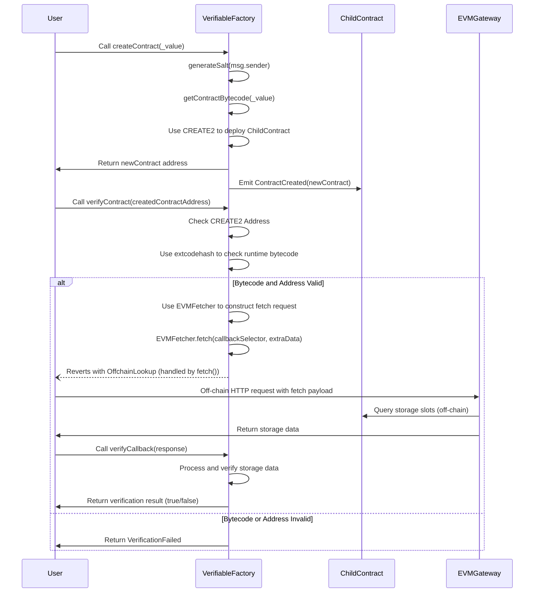

## Verifiable Factory Contract

### Components

#### 1. Verifiable Factory Contract

- The VerifiableFactory contract is responsible for deploying ChildContract instances using CREATE2
- It also handles the verification of deployed contracts:
    - On-chain: Verifies the contract's address and bytecode using CREATE2 and extcodehash.
    - Off-chain: Triggers a CCIP-Read flow when further verification (like storage layout consistency) is required.

#### 2. Child Contract

- The ChildContract is a simple contract deployed by the factory. It stores two key values for MVP purposes:
    - value: A uint256 value passed during deployment.
    - factory: The address of the factory contract that deployed it.
- These storage slots are verified during the off-chain proof process.

#### 3. EVMGateway

- This is the off-chain service responsible for providing Merkle proofs of the contract's storage layout. 

### Architecture

