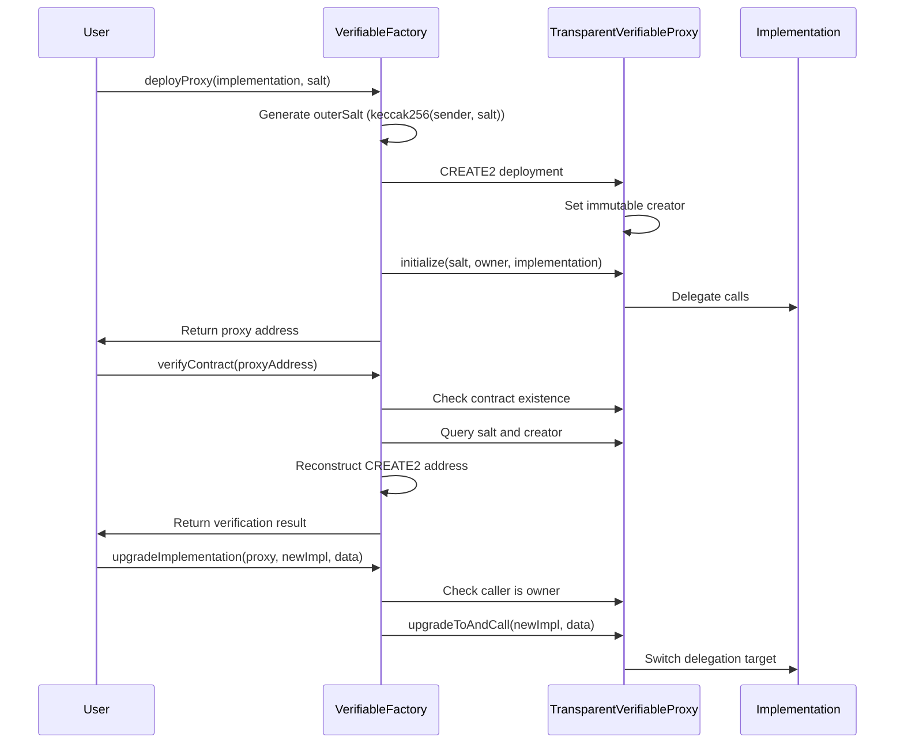

# Verifiable Factory Contract

A system for deploying and verifying proxy contracts with predictable storage layouts and deterministic addresses using CREATE2.

## Components

### 1. Verifiable Factory Contract
- Deploys TransparentVerifiableProxy instances using CREATE2 opcode
- Handles on-chain verification of deployed proxies
- Manages proxy upgrades through a secure ownership model
- Uses deterministic salt generation for predictable addresses

### 2. TransparentVerifiableProxy
- Transparent proxy pattern with verified storage layout
- Fixed storage slots via [SlotDerivation](https://docs.openzeppelin.com/contracts/5.x/api/utils#SlotDerivation) under `proxy.verifiable` namespace
  - `salt` (uint256)
  - `owner` (address)
- Immutable `creator` field (set in bytecode)
- Implements secure upgrade mechanism
- Initializable to prevent implementation tampering

## Architecture

